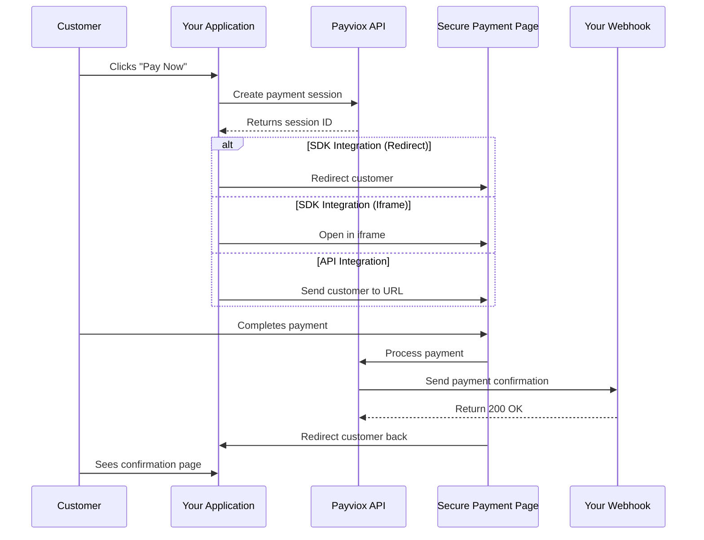

## Welcome to Payviox

Payviox provides a simple and flexible payment infrastructure. You can integrate payments in minutes by choosing between two integration methods, and automatically receive payment confirmations via webhooks.

<Info>
**New to Payviox?** This guide explains the complete payment flow from start to finish.
</Info>

## Payment Flow

Here's how a typical payment works with Payviox:

## Step-by-Step Flow

<Steps>
<Step title="Customer initiates payment">
Your customer clicks a "Pay Now" button or starts the checkout process on your website.
</Step>

<Step title="Create a payment session">
Your application calls Payviox (via SDK or API) to create a payment session with order details, amount, currency, and items.
</Step>

<Step title="Redirect to secure payment page">
The customer is redirected to Payviox's secure payment page (or it opens in an iframe) where they can complete their payment.
</Step>

<Step title="Customer completes payment">
The customer enters their payment details and confirms the transaction on the secure Payviox page.
</Step>

<Step title="Webhook notification">
**Immediately after payment**, Payviox sends a webhook to your server with the payment status and details. This is how you know the payment was successful.
</Step>

<Step title="Customer returns to your site">
After payment, the customer is redirected back to your website where you can show them a confirmation page.
</Step>
</Steps>

## Next Steps

<CardGroup cols={2}>
<Card title="Choose Integration Method" icon="code" href="/quickstart/integration-methods">
Compare SDK vs API integration
</Card>

<Card title="Understanding Webhooks" icon="webhook" href="/quickstart/webhooks">
Learn about payment notifications
</Card>

<Card title="SDK Integration" icon="code" href="/sdk/introduction">
Start with the JavaScript SDK
</Card>

<Card title="API Integration" icon="server" href="/api/introduction">
Use the REST API
</Card>
</CardGroup>

